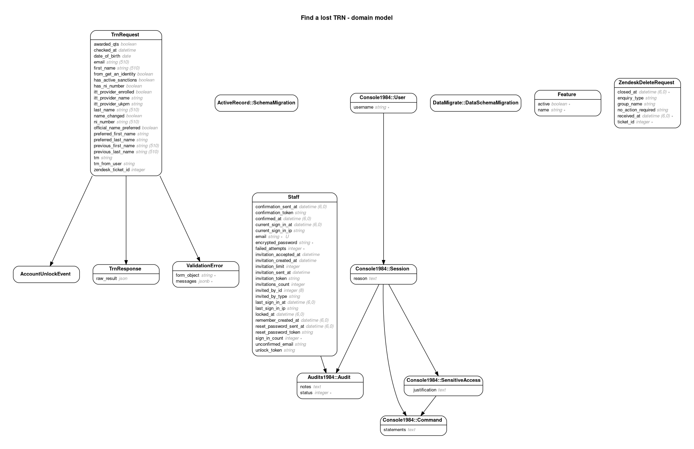

# Find a lost TRN

A service that allows teachers to find their Teacher Reference Number (TRN).

## Live environments

### Links and application names

| Name       | URL                                               | Deployment | PaaS space       | PaaS application             |
| ---------- | ------------------------------------------------- | ---------- | ---------------- | ---------------------------- |
| Production | https://find-a-lost-trn.education.gov.uk/         | Manual     | `tra-production` | `find-a-lost-trn-production` |
| Preprod    | https://preprod-find-a-lost-trn.education.gov.uk/ | Manual     | `tra-test`       | `find-a-lost-trn-preprod`    |
| Test       | https://test-find-a-lost-trn.education.gov.uk/    | Manual     | `tra-test`       | `find-a-lost-trn-test`       |
| Dev        | https://dev-find-a-lost-trn.education.gov.uk/     | Automatic  | `tra-dev`        | `find-a-lost-trn-dev`        |

### Details and configuration

| Name       | Description                                   | Zendesk | Notify   | `qualified-teachers-api` |
| ---------- | --------------------------------------------- | ------- | -------- | ------------------------ |
| Production | Public site                                   | Live    | Live key | Production               |
| Preprod    | For internal use by DfE to test deploys       | Live    | Live key | Production               |
| Test       | For external use by 3rd parties to run audits | Stubbed | Live key | Preprod                  |
| Dev        | For internal use by DfE for testing           | Stubbed | Test key | Preprod                  |

Gotchas:

- Dev uses a `test` Notify key so it doesn't send real emails. You have to
  check the API integration section of Notify to see them.
- Dev uses the `preprod` deployment of the `qualified-teachers-api` which
  allows us to find the TRNs of test users.

### Test users

You can use this user to test that matching works against the preprod
`qualified-teachers-api` (for example, on `find-a-lost-trn-dev`):

| Field                     | Value       |
| ------------------------- | ----------- |
| First name                | `Kevin`     |
| Last name                 | `E`         |
| Date of birth             | `1 1 1990`  |
| National insurance number | `AA123456A` |

## Dependencies

- Ruby 3.x
- Node.js 16.x
- Yarn 1.22.x
- PostgreSQL 13.x
- Redis 6.x

## Local development dependencies

- Graphviz 2.22+ (brew install graphviz) to generate the [domain model diagram](#domain-model)

## How the application works

Find a lost TRN is a monolithic Rails app built with the GOVUK Design System and hosted on
GOVUK PaaS.

We keep track of architecture decisions in [Architecture Decision Records
(ADRs)](/adr/).

We use `rladr` to generate the boilerplate for new records:

```bash
bin/bundle exec rladr new title
```

## Setup

### Bare metal

Install dependencies using your preferred method, using `asdf` or `rbenv` or `nvm`. Example with `asdf`:

```bash
# The first time
brew install asdf # Mac-specific
asdf plugin add azure-cli
asdf plugin add ruby
asdf plugin add nodejs
asdf plugin add yarn
asdf plugin add postgres
asdf plugin add redis

# To install (or update, following a change to .tool-versions)
asdf install
```

If installing PostgreSQL via `asdf`, set up the `postgres` user:

```bash
pg_ctl start
createdb default
psql -d default
> CREATE ROLE postgres LOGIN SUPERUSER;
```

You might also need to install `postgresql-libs`:

```bash
sudo apt install libpq-dev
sudo yum install postgresql-devel
sudo zypper in postgresql-devel
sudo pacman -S postgresql-libs
```

If installing Redis, you'll need to start it in a separate terminal:

```bash
redis-server
```

Setup the project (re-run after `Gemfile` or `package.json` updates, automatically restarts any running Rails server):

```bash
bin/setup
```

Run the application on `http://localhost:3000`:

```bash
bin/dev
```

### Notify

If you want to test and simulate sending emails locally, you need to be added
to the TRA digital Notify account. Then, go to
`API integration > API keys > Create an API key` and create a new key, such as
`Myname - local test` and set the type to `Test - pretends to send messages`.

Add this key to your local development secrets:

```bash
$ vim .env.development.local
GOVUK_NOTIFY_API_KEY=theo__local_test-abcefgh-1234-abcdefgh
```

When you send an email locally, the email should appear in the message log in
the Notify dashboard in the `API integration` section.

### Docker

To run the application locally in production mode (to test that the container
builds and runs successfully):

```bash
docker build .
docker run --net=host --env-file .env.development <SHA>
```

### Linting

To run the linters:

```bash
bin/lint
```

### Testing

To run the tests (requires Chrome due to
[cuprite](https://github.com/rubycdp/cuprite)):

```bash
bin/test
```

### Intellisense

[solargraph](https://github.com/castwide/solargraph) is bundled as part of the
development dependencies. You need to [set it up for your
editor](https://github.com/castwide/solargraph#using-solargraph), and then run
this command to index your local bundle (re-run if/when we install new
dependencies and you want completion):

```sh
bin/bundle exec yard gems
```

You'll also need to configure your editor's `solargraph` plugin to
`useBundler`:

```diff
+  "solargraph.useBundler": true,
```

### Domain model



Regenerate this diagram with `bundle exec rake erd`.

### Ops manual

[OPS manual](docs/ops-manual.md).

## Licence

[MIT Licence](LICENCE).
