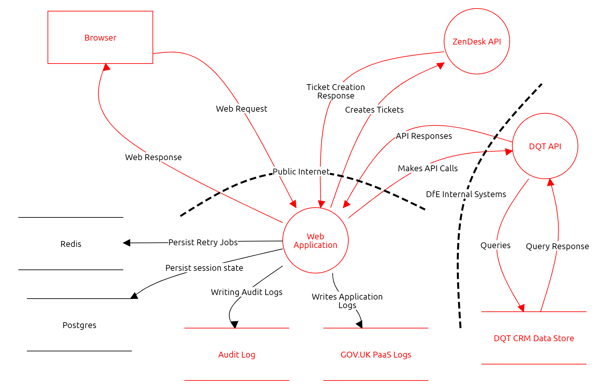

# Find a lost TRN - Technical Architecture

## Overview

The Find a lost TRN service is a public facing web application that allows its users to retrieve their TRN by supplying personal information. It works by querying the DQT API with the supplied details, and returning them to the user. As a fallback, if the DQT API is unavailable, the Find a lost TRN service will create a ticket in a Zendesk system that the supporting team will then pick up, and handle manually.

The web primary web application in hosted in AKS, uses a Postgres database for persistence and a Redis instance for retry logic for deferred executions of tasks.

## Architecture Diagram

